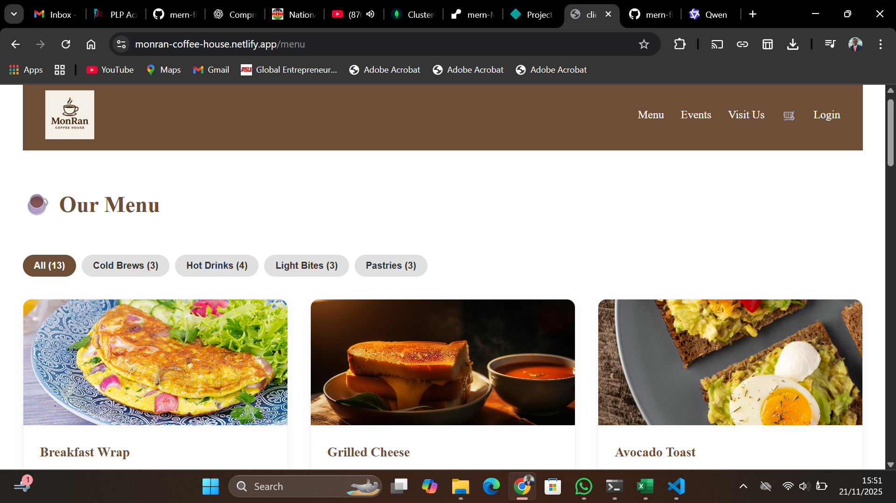
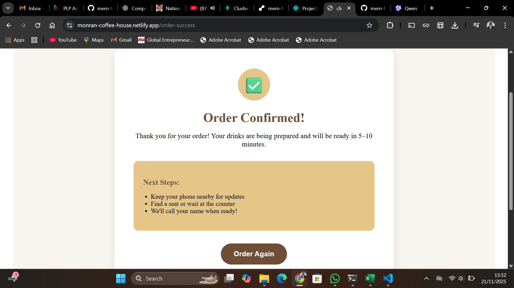

# ☕ Monran Coffee House – MERN Capstone Project

Monran Coffee House is a full-stack web application that digitizes the café ordering experience. Customers can browse the coffee and food menu, add items to a shopping cart, place orders, and view their order history. Admin users can manage menu items and monitor incoming orders—making it a complete solution for small cafés looking to streamline service.

Built with the **MERN stack** (MongoDB, Express, React, Node.js), this project demonstrates modern full-stack development practices including JWT-based authentication, RESTful API design, responsive UI, testing, CI/CD, and cloud deployment.

---

## 🔗 Live Application

- **Frontend (Netlify)**: [https://monran-coffee-house.netlify.app](https://monran-coffee-house.netlify.app)  
- **Backend API (Render)**: [https://monran-coffee-house.onrender.com](https://monran-coffee-house.onrender.com)


---

## 🎥 Video Demonstration

Watch a **5-minute walkthrough** of Monran Coffee House in action:


🔗 **Video Link**: [https://docs.google.com/videos/d/1kWyzfFW5-Zt9EKrvlY8IKN-o5tPQdxfFNVZk4P9A-ks/edit?usp=sharing]  
*(e.g., Loom, YouTube, or Google Drive)*

The demo covers:
- User registration & login
- Browsing the menu
- Adding items to cart and checking out
- Viewing order history
- Admin dashboard (product management)

---

## 📸 Screenshots

### 🛒 Customer Experience
| Menu View | Shopping Cart | Order Confirmation |
|----------|---------------|--------------------|
|  |
 |

### 👨‍💻 Admin Dashboard
| Manage Products | View Live Orders |
|------------------|------------------|
|  |  |

> Screenshots are stored in [`screenshots/`](screenshots/).

---

## 🛠️ Local Setup

### Prerequisites
- [Node.js](https://nodejs.org/) (v18 or higher)
- [MongoDB Atlas account](https://www.mongodb.com/atlas) (or local MongoDB instance)
- Git

### 1. Clone the repository
```bash
git clone https://github.com/your-username/monran-coffee-house.git
cd monran-coffee-house